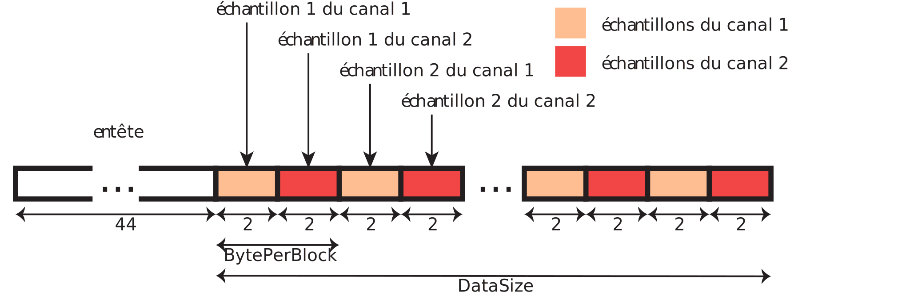
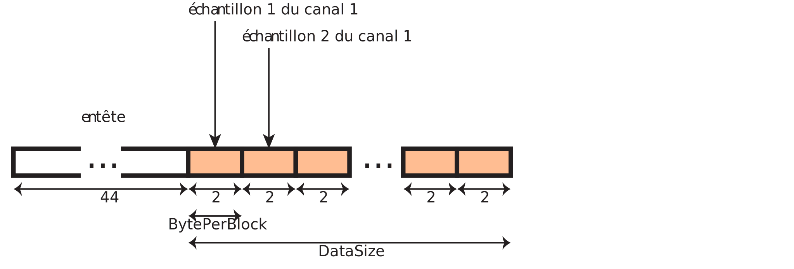
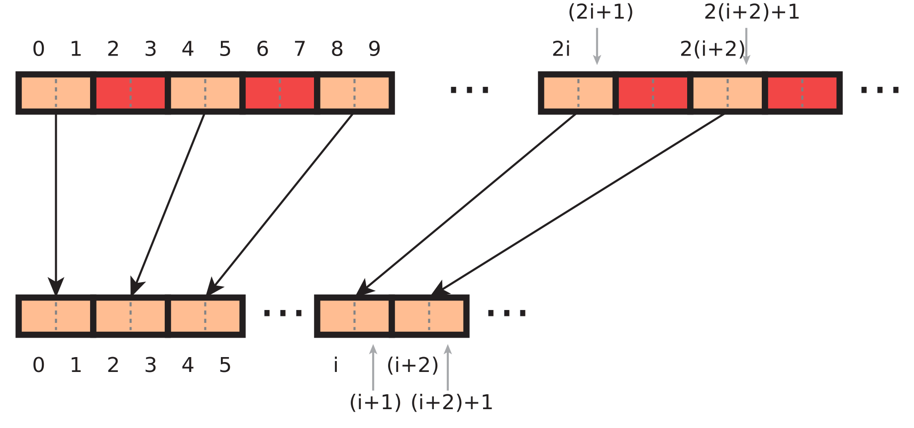

# TD n°4 - Manipulation de fichiers

Dans ce TD nous allons utiliser les appels systèmes d'entrée/sortie pour manipuler des fichiers représentant des images et des sons.

**Tous les programmes écrits doivent gérer les éventuelles erreurs qui peuvent se produire lors de l'utilisation de l'appel systèmes `open` (en cas d'erreur, affichez un message adapté à l'aide de `perror` et interrompez l'exécution du programme).**

## Images en niveaux de gris

Dans cette section, nous allons manipuler des images en niveaux de gris stockées au format *Portable Gray Map* `pgm`). Un fichier `pgm` contient un entête suivi d'une partie de données binaires dans laquelle chaque point de l'image (pixel) est représenté par un octet du fichier, correspondant à son intensité en niveau de gris (0 : noir, 255: blanc).

L'entête comporte au moins trois lignes :
- un code (ou *magic number* indiquant le format ("P5" pour le `pgm`) ;
- la largeur de l'image, suivie de la hauteur. Les valeurs sont représentées par leurs représentations binaires (caractères ASCII) et sont séparées par au moins un espace ;
- la valeur maximale des niveaux de gris utilisés (en général 255), également en décimal ASCII. Cette valeur correspond à du blanc.

L'entête peut également contenir d'autres lignes de commentaires commençant par le caractère `#`. Pour simplifier les choses, on supposera dans ce TP que les entêtes ne contiennent pas de commentaires et que le niveau de gris maximum est 255.

Par exemple, un fichier `pgm` pourrait commencer de la manière suivante :
```
P5
4320 3240
255
"+-6HB59;31.+*+35...
```

1. En utilisant la commande `convert` (vue au premier semestre), convertissez l'image de votre choix au format `pgm`. Renommez l'image produite en `image.pgm`.

    **Remarque :** Pour visualiser les images `pgm`, vous pouvez utiliser le programme *gimp*.

1. Écrivez un programme `negative.c` qui prend en argument deux noms de fichiers, ouvre le premier (que l'on suppose être une image au format `pgm`) et écrit dans le second une image correspondant à une inversion d'intensité de chacun des pixels de l'image de départ.

    **Remarque :** Pour lire l'entête du fichier, vous pouvez utiliser la fonction `lireligne` vue dans le TP précédent (disponible dans le code fourni)

## Images en couleur

On s'intéresse maintenant aux images au format *Portable Pixel Map* (`ppm`). Tout comme pour le format `pgm`, les fichiers `ppm` commencent par un entête suivi de données binaires où chaque pixel de l'image est représenté par trois octets correspondant aux niveaux de rouge, vert et bleu de la couleur du pixel. Le format de l'entête est semblable à celui du format `pgm` :
- un *magic number* ("P6" pour le format `ppm`) ;
- la largeur et la hauteur de l'image données en décimal ASCII ;
- le nombre de niveaux de chaque composante de couleur (en général 255).

1. Convertissez une image au format `ppm`, en la nommant `image.ppm`.

1. Écrivez un programme `intensite.c` qui prend en argument deux noms de fichiers et un entier, et modifie l'intensité de chaque composante des pixels de l'image correspondant au premier argument (qu'on suppose être au format `ppm`) en lui ajoutant la valeur reçue en troisième argument (si le troisième argument est 15 par exemple, alors chaque composante doit être augmentée de 15). Le résultat est sauvegardée sous le nom passé en second argument.
	
    **Attention :** La valeur de chaque composante doit rester entre 0 et 255.
	
	**Indication :** Les arguments reçus par le programme sont tous des chaînes de caractères. Ceux qui représentent des entiers doivent donc être convertis en une variable de type `int`. Vous pouvez utiliser les fonctions [`strtol`](http://man7.org/linux/man-pages/man3/strtol.3.html) (un peu compliquée mais recommandée) ou [`atoi`](http://man7.org/linux/man-pages/man3/atoi.3.html) (beaucoup plus simple mais moins robuste).

1. (Optionnel) Écrivez un programme `miroir.c` qui permet de réaliser un effet de miroir vertical ou horizontal sur une image `pgm` ou `ppm`.
	
	Le programme doit prendre en paramètre une option indiquant le type de symétrie à appliquer ainsi que les noms des fichiers en entrée et en sortie. Si la première option est `-v`, il faut appliquer une symétrie selon un axe vertical, si c'est `-h` l'axe est horizontal.
	
	**Indication :** Il faut lire les données de l'image et les mémoriser dans un tableau (c'est plus simple pour le miroir vertical parce qu'on peut travailler ligne par ligne). Si l'image est grande, les tableaux ne peuvent pas être alloués de manière automatique et il faut alors utiliser l'allocation dynamique (`malloc`).
	
## Conversion de fichiers audio

### Présentation du format WAV

On s'intéresse dans cet exercice aux fichiers audio au format WAV codés en *modulation par impulsion et codage*, en anglais *Pulse Code Modulation* (PCM), permettant d'encoder un son en enregistrant les valeurs de l'intensité du signal (onde sonore) à intervalles de temps réguliers.

Les fichiers audio peuvent contenir un ou plusieurs canaux qui correspondent au nombre de sources servant à reproduire le son. Chaque canal est constitué d'une suite de valeurs numériques (les *échantillons*) permettant de reconstruire l'onde sonore à laquelle il correspond.

**Dans cet exercice on ne considérera que des fichiers *mono* (1 canal) ou *stereo* (2 canaux), et on supposera que tous les échantillons sont représentés sur 16 bits (2 octets).**

Les fichiers WAV sont constitués d'un entête donnant des informations sur le codage utilisé (format, nombre de canaux, nombre d'échantillons par seconde, etc.), suivi des octets de données encodant les valeurs des échantillons de tous les canaux.

L'entête d'un fichier WAV commence dès le premier octet (*offset* 0). Il a une taille de 44 octets, et est constitué des champs suivants listés dans l'ordre ([réf](https://fr.wikipedia.org/wiki/Waveform_Audio_File_Format)). Il n'est pas nécessaire de comprendre la signification de tous les champs pour le moment :

```
[Bloc de déclaration d'un fichier au format WAVE]
   FileTypeBlocID  (4 octets) : Constante «RIFF»  (0x52,0x49,0x46,0x46)
   FileSize        (4 octets) : Taille du fichier moins 8 octets
   FileFormatID    (4 octets) : Format = «WAVE»  (0x57,0x41,0x56,0x45)

[Bloc décrivant le format audio]
   FormatBlocID    (4 octets) : Identifiant «fmt »  (0x66,0x6D, 0x74,0x20)
   BlocSize        (4 octets) : Nombre d'octets du bloc - 16  (0x10)
   AudioFormat     (2 octets) : Format du stockage dans le fichier (1: PCM, ...)
   NbrCanaux       (2 octets) : Nombre de canaux (de 1 à 6)
   Frequence       (4 octets) : Fréquence d'échantillonnage (en hertz) [Valeurs 
      standardisées : 11 025, 22 050, 44 100 et éventuellement 48 000 et 96 000]
   BytePerSec      (4 octets) : Nombre d'octets à lire par seconde (c.-à-d., 
   Frequence * BytePerBloc).
   BytePerBlock    (2 octets) : Nombre d'octets par bloc d'échantillonnage 
      (c.-à-d., tous canaux confondus : NbrCanaux * BitsPerSample/8).
   BitsPerSample   (2 octets) : Nombre de bits utilisés pour le codage de 
      chaque échantillon (8, 16, 24)

[Bloc des données]
   DataBlocID      (4 octets) : Constante «data»  (0x64,0x61,0x74,0x61)
   DataSize        (4 octets) : Nombre d'octets des données (c.-à-d.
      taille_du_fichier - taille_de_l'entête  (qui fait 44 octets normalement).
```

Après l'entête, le fichier contient les octets de données représentant les échantillons des différents canaux en alternance :


*Contenu d'un fichier WAV correspondant à un enregistrement sur 2 canaux (stereo) avec des échantillons sur 16 bits (2 octets).*


*Contenu d'un fichier WAV correspondant à un enregistrement sur 1 canal (mono) avec des échantillons sur 16 bits (2 octets).*

### Organisation du programme

Le but de l'exercice est d'écrire un programme qui prend en entrée un fichier WAV à deux canaux (stereo) et le convertit en un fichier à un seul canal (mono) en ne conservant que le premier canal.

Le programme devra donc exécuter les actions suivantes :
- ouvrir le fichier contenant les données d'entrée (en lecture) et le fichier où écrire la sortie (en écriture) ;
- lire l'entête du fichier en entrée, modifier les valeurs qui changent lorsque le fichier est converti en mono et écrire le nouvel entête dans le fichier en sortie ;
- lire les données du fichier en entrée et ne recopier dans le fichier en sortie que les octets correspondant aux échantillons du premier canal.

On part du squelette de programme suivant (fichier `mono.c`) :
```cpp
#include <stdio.h>
#include <stdlib.h>
#include <fcntl.h>
#include <sys/types.h>
#include <sys/uio.h>
#include <unistd.h>

int main(int argc, char **argv) {
	int fdin, fdout; // descripteurs de fichiers en entrée et en sortie
	char buffer[4096];	// buffer utilisée pour les lectures/écritures
	int nbread;	// nombre d'octets lus après chaque appel à read
	
	
	// [1] Ouverture des fichiers en entrée et sortie
	// le nom du fichier à lire est passé en premier argument du programme, le
	// nom du fichier dans lequel écrire le résultat est passé en second 
	// argument
	
	
	// [2] Lecture de l'entête du fichier en entrée, modification des données 
	// nécessaires dans le buffer et écriture de l'entête modifié dans le 
	// fichier en sortie
	
	
	// [3] Lecture des données du fichier en entrée (par blocs de 4096 octets) 
	// et écriture dans le fichier en sortie des octets correspondant aux 
	// échantillons du premier canal.
	
	
	close(fdin);
	close(fdout);
}
```

1. Écrivez les instructions permettant d'ouvrir en lecture seule le fichier dont le nom est passé en premier argument du programme (le descripteur de fichier est placé dans la variable `fdin`), et d'ouvrir en écriture seule le fichier dont le nom est passé en second argument (dans la variable `fdout`). On pourrait par exemple appeler le programme à l'aide de la commande `./a.out entree.wav sortie.wav`

    - Si le fichier en écriture n'existe pas il faut le créer et s'il existe il faut le réinitialiser (effacer son contenu).
	- Si l'ouverture d'un des fichiers ne s'effectue pas correctement, le programme doit afficher un message d'erreur approprié et terminer son exécution.

1. Ajoutez l'instruction permettant de lire les octets de l'entête du fichier en entrée pour les placer dans le tableau `buffer`. On rappelle que la longueur de l'entête est toujours 44 octets.

    Il faut maintenant modifier les informations suivantes dans l'entête du fichier (qui se trouve dans le tableau `buffer`) :
    - `FileSize` (octets 4-7): cet `int` représente la taille du fichier moins 8 octets (c'est-à-dire le nombre d'octets restant dans le fichier après cette valeur). Dans le fichier mono en sortie, l'entête a la même taille (44 octets) mais il y a deux fois moins d'octets de données.
    - `NbrCanaux` (octets 22-23): ce `short int` (entier codé sur deux octets) contient la valeur 2 dans le fichier en entrée mais doit contenir 1 dans le fichier en sortie.
    - `BytePerSec` (octets 28-31): cet `int` doit être divisé par 2 pour obtenir la valeur correspondant à un fichier mono.
    - `BytePerBlock` (octets 32-33): ce `short int` doit également être divisé par 2.
    - `DataSize` (octets 40-43): cet `int` doit être divisé par 2.

1. Écrivez les instructions permettant de modifier le contenu du tableau `buffer` contenant initialement l'entête du fichier en entrée pour qu'il contienne l'entête du fichier en sortie.

	**Indications :** On suppose ici que les `int` sont stockés sur 4 octets et que les `short int` sont stockés sur 2 octets. On suppose également que l'ordre des octets dans la représentation d'un entier (`int` ou `short int`) du système est le même que celui utilisé dans le format WAV (*little-endian*). Avec ces hypothèses, on peut manipuler les valeurs dans le tableau `buffer` de la manière suivante :
    ```cpp
	    int *p; 
	    p = (int *) (buffer + 14);
	    // p est un pointeur vers un entier dont la représentation commence à la
	    // case 14 du tableau buffer
	    
	    *p = *p + 42;
	    // l'entier dont la représentation commence à la case 14 du tableau buffer
	    // a été incrémenté de 42 (les valeurs dans le tableau ont été modifiées)
	```

1. Écrivez l'instruction permettant d'écrire le nouvel entête (qui se trouve dans le tableau `buffer`) dans le fichier en sortie.

1. Écrivez la boucle permettant de copier tous les octets du fichier en entrée correspondant aux échantillons du premier canal dans le fichier en sortie.
	
	**Indications :** Il faut lire les octets du fichier en entrée dans le tableau `buffer` par blocs de (au plus) 4096 octets, puis déplacer les octets correspondant aux échantillons du premier canal pour les grouper au début du tableau `buffer` (voir figure suivante). Il faut enfin recopier le début du tableau `buffer` (correspondant aux octets du premier canal qui ont été déplacés) dans le fichier en sortie.
	
	La boucle doit être interrompue lorsque tous les octets du fichier en entrée ont été lus.
    
    
    *Déplacement des octets correspondant aux échantillons du premier canal d'un fichier stereo (en clair en haut) dans le début du tableau pour correspondre à l'encodage d'un fichier mono (en bas).*
